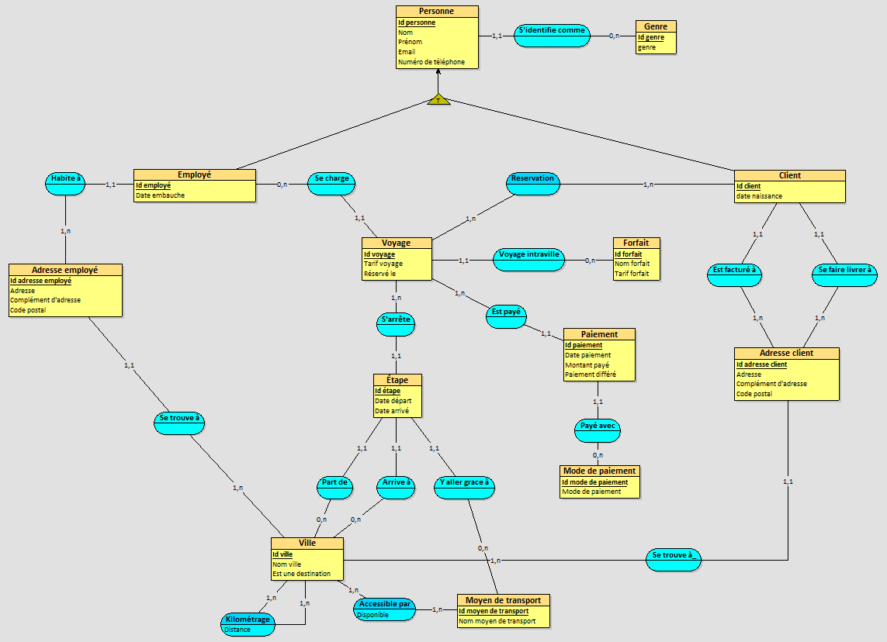

# Projet-Donnees-et-modelisation
Projet BDD CPI A1 réalisé par Fabien formant le groupe GP3.3.

Notre mission était de réaliser une base de données pour une agence de voyage en répondant à un certains nombre de contraintes.

La structure de la BDD se trouve dans le fichier [SQL.sql](SQL.sql), les données a insérer dans [Données.sql](Données.sql) et les différents requêtes à réaliser dans [Requêtes.sql](Requêtes.sql)
Les requêtes sont les suivantes :
* Connaitre les villes les plus prisées.
* Connaitre la proportion des voyages intra-villes et inter-villes.
* Identifier le moyen de transport le plus utilisé sur les 3 derniers mois.
* Connaitre le nombre moyen d’enfants qui voyagent les 6 derniers mois.

Voici le MDC réalisé :
